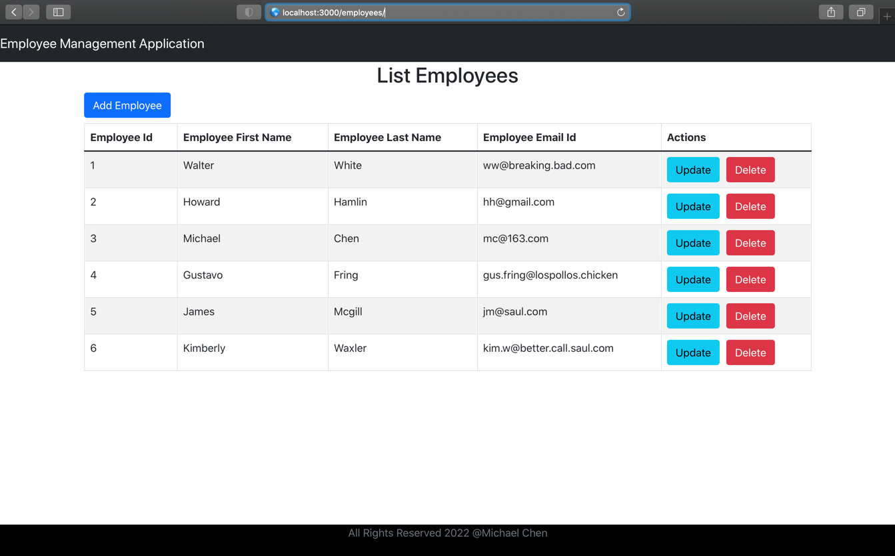
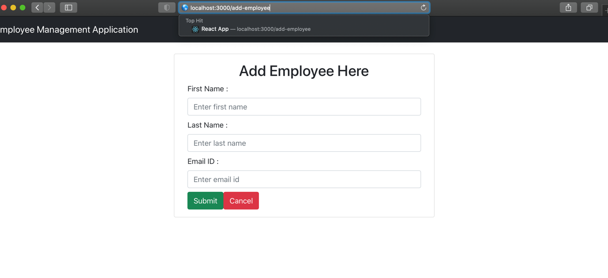
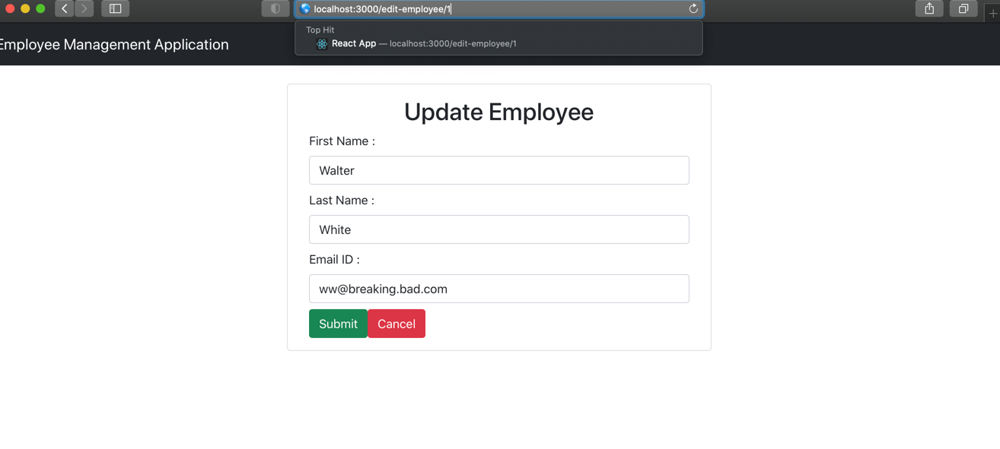

# Employee Management System
## Overview
A complete full-stack web application: React Hooks and Spring Boot CRUD Full Stack App to manage employees.

## Tools
* Spring boot as backend
  * use Spring Data JPA to manage relational data 
* React (React Hooks) as frontend
  * introduce axios to help with HTTP request as a client
* MySQL database to store and retrieve the data

## Screenshot Demo
+ List of Employees

+ Add Employee Form

+ Update Employee Form

